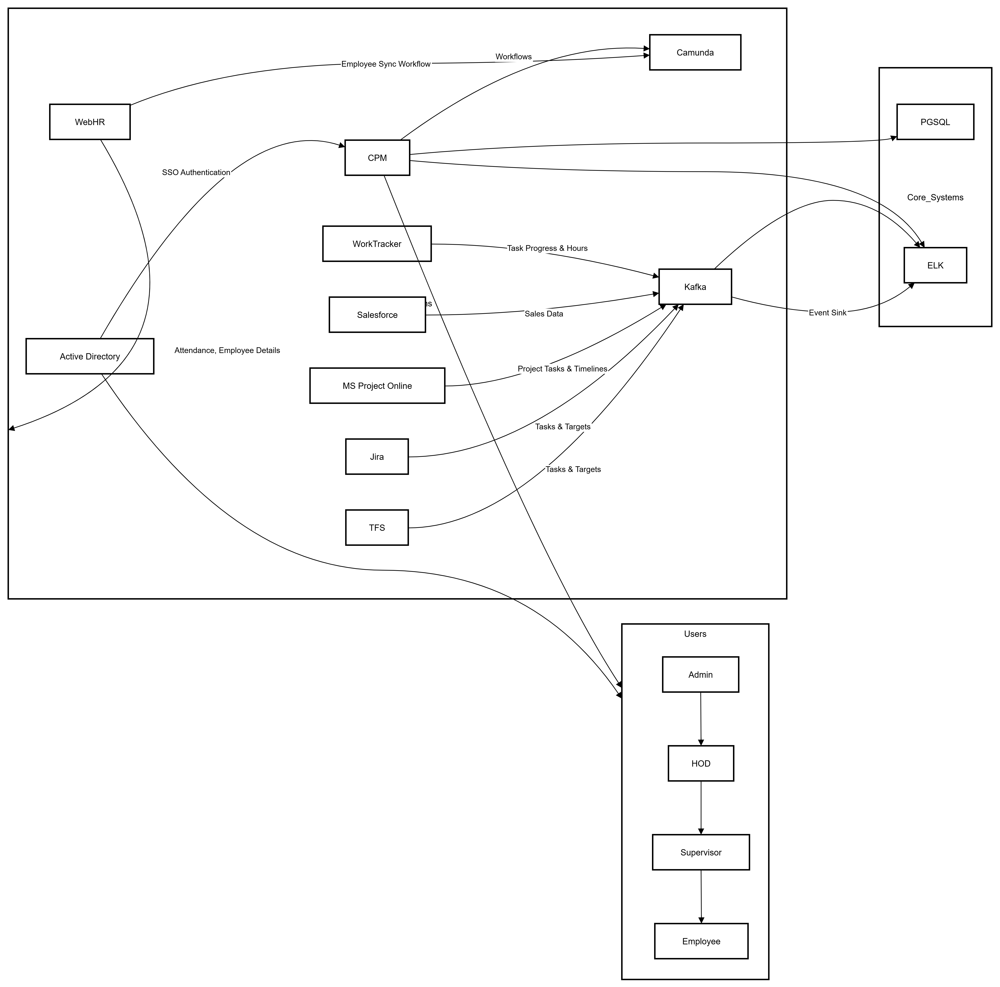
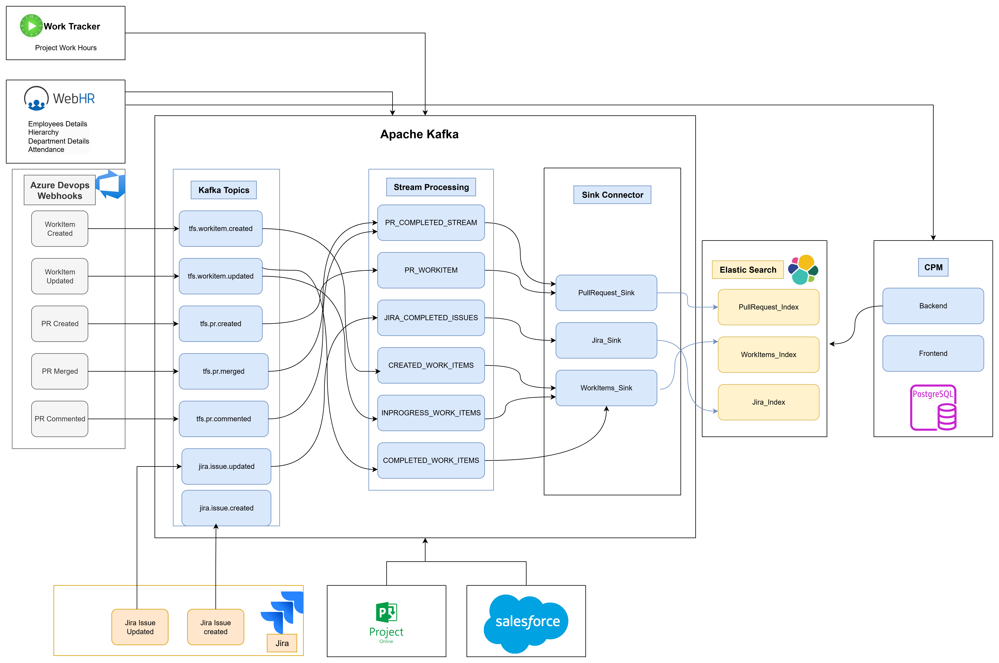

# CPM System Technical Architecture

## Kafka Stream Processing

### Event Sources Integration
The CPM system integrates with **Jira** and **TFS** to capture real-time project events:
- Issue creation/updates
- Workflow transitions 
- Assignment changes
- Sprint/iteration events

### Stream Processing Pipeline
Events are processed through a Kafka stream processing architecture:
- **Topic**: `cpm-project-events`
- **Partitions**: 12 (for parallel processing)
- **Retention**: 7 days
- **Replication Factor**: 3

Data transformation includes event enrichment, validation, and routing to downstream systems.

## Elasticsearch Integration

### NoSQL Database Functionality
Elasticsearch serves as the primary **NoSQL database** for storing and querying performance data:

```json
{
  "resource_id": "emp_12345",
  "timestamp": "2025-01-15T10:30:00Z",
  "scorecard": {
    "overall_score": 85.4,
    "kpis": [
      {
        "name": "Code Quality",
        "score": 92.1,
        "weight": 0.3
      },
      {
        "name": "Delivery Timeliness", 
        "score": 78.5,
        "weight": 0.4
      }
    ]
  }
}
```

### Aggregation Capabilities
Multi-dimensional analytics for:
- Team performance trends
- Individual KPI progression
- Cross-project comparisons
- Real-time dashboard metrics

## Scorecard Storage Structure

### Resource-Based Scorecards
Each resource (employee/team) has dedicated scorecard documents:
- **Index Pattern**: `cpm-scorecards-*`
- **Document Type**: Resource scorecard with nested KPI records
- **Refresh Rate**: Real-time (1s)

### KPI Structure
Individual KPI records track:
- Historical measurements
- Trend analysis data
- Threshold compliance
- Performance benchmarks



